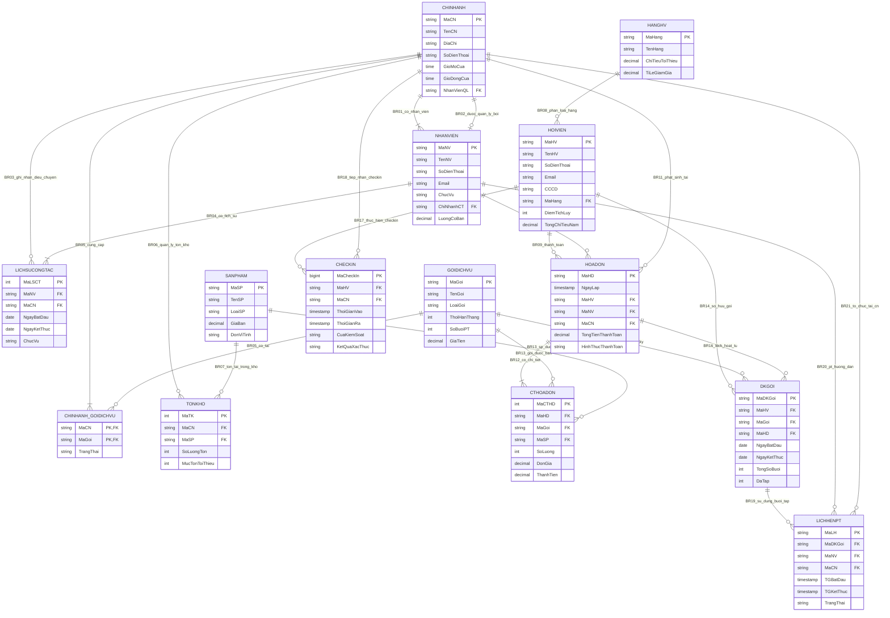

## SƠ ĐỒ THỰC THỂ - MỐI KẾT HỢP (ERD DIAGRAM)

Dưới đây là sơ đồ Mermaid ERD chuẩn hóa thể hiện toàn diện 14 thực thể và 21 quy tắc quan hệ:

```mermaid
erDiagram
    CHINHANH ||--|{ NHANVIEN : "BR01_co_nhan_vien"
    CHINHANH ||--o| NHANVIEN : "BR02_duoc_quan_ly_boi"
    CHINHANH ||--o{ LICHSUCONGTAC : "BR03_ghi_nhan_dieu_chuyen"
    NHANVIEN ||--|{ LICHSUCONGTAC : "BR04_co_lich_su"
    
    CHINHANH ||--|{ CHINHANH_GOIDICHVU : "BR05_cung_cap"
    GOIDICHVU ||--o{ CHINHANH_GOIDICHVU : "BR05_co_tai"
    
    CHINHANH ||--o{ TONKHO : "BR06_quan_ly_ton_kho"
    SANPHAM ||--o{ TONKHO : "BR07_ton_tai_trong_kho"
    
    HANGHV ||--o{ HOIVIEN : "BR08_phan_loai_hang"
    
    HOIVIEN ||--o{ HOADON : "BR09_thanh_toan"
    NHANVIEN ||--o{ HOADON : "BR10_lap_hoa_don"
    CHINHANH ||--o{ HOADON : "BR11_phat_sinh_tai"
    
    HOADON ||--|{ CTHOADON : "BR12_co_chi_tiet"
    GOIDICHVU ||--o{ CTHOADON : "BR13_goi_duoc_ban"
    SANPHAM ||--o{ CTHOADON : "BR13_sp_duoc_ban"
    
    HOIVIEN ||--o{ DKGOI : "BR14_so_huu_goi"
    GOIDICHVU ||--o{ DKGOI : "BR15_duoc_dang_ky"
    HOADON ||--o{ DKGOI : "BR16_kich_hoat_tu"
    
    HOIVIEN ||--o{ CHECKIN : "BR17_thuc_hien_checkin"
    CHINHANH ||--o{ CHECKIN : "BR18_tiep_nhan_checkin"
    
    DKGOI ||--o{ LICHHENPT : "BR19_su_dung_buoi_tap"
    NHANVIEN ||--o{ LICHHENPT : "BR20_pt_huong_dan"
    CHINHANH ||--o{ LICHHENPT : "BR21_to_chuc_tai_cn"

    CHINHANH {
        string MaCN PK
        string TenCN
        string DiaChi
        string SoDienThoai
        time GioMoCua
        time GioDongCua
        string NhanVienQL FK
    }

    NHANVIEN {
        string MaNV PK
        string TenNV
        string SoDienThoai
        string Email
        string ChucVu
        string ChiNhanhCT FK
        decimal LuongCoBan
    }

    LICHSUCONGTAC {
        int MaLSCT PK
        string MaNV FK
        string MaCN FK
        date NgayBatDau
        date NgayKetThuc
        string ChucVu
    }

    HANGHV {
        string MaHang PK
        string TenHang
        decimal ChiTieuToiThieu
        decimal TiLeGiamGia
    }

    HOIVIEN {
        string MaHV PK
        string TenHV
        string SoDienThoai
        string Email
        string CCCD
        string MaHang FK
        int DiemTichLuy
        decimal TongChiTieuNam
    }

    GOIDICHVU {
        string MaGoi PK
        string TenGoi
        string LoaiGoi
        int ThoiHanThang
        int SoBuoiPT
        decimal GiaTien
    }

    CHINHANH_GOIDICHVU {
        string MaCN PK, FK
        string MaGoi PK, FK
        string TrangThai
    }

    SANPHAM {
        string MaSP PK
        string TenSP
        string LoaiSP
        decimal GiaBan
        string DonViTinh
    }

    TONKHO {
        int MaTK PK
        string MaCN FK
        string MaSP FK
        int SoLuongTon
        int MucTonToiThieu
    }

    HOADON {
        string MaHD PK
        timestamp NgayLap
        string MaHV FK
        string MaNV FK
        string MaCN FK
        decimal TongTienThanhToan
        string HinhThucThanhToan
    }

    CTHOADON {
        int MaCTHD PK
        string MaHD FK
        string MaGoi FK
        string MaSP FK
        int SoLuong
        decimal DonGia
        decimal ThanhTien
    }

    DKGOI {
        string MaDKGoi PK
        string MaHV FK
        string MaGoi FK
        string MaHD FK
        date NgayBatDau
        date NgayKetThuc
        int TongSoBuoi
        int DaTap
    }

    CHECKIN {
        bigint MaCheckIn PK
        string MaHV FK
        string MaCN FK
        timestamp ThoiGianVao
        timestamp ThoiGianRa
        string CuaKiemSoat
        string KetQuaXacThuc
    }

    LICHHENPT {
        string MaLH PK
        string MaDKGoi FK
        string MaNV FK
        string MaCN FK
        timestamp TGBatDau
        timestamp TGKetThuc
        string TrangThai
    }
```